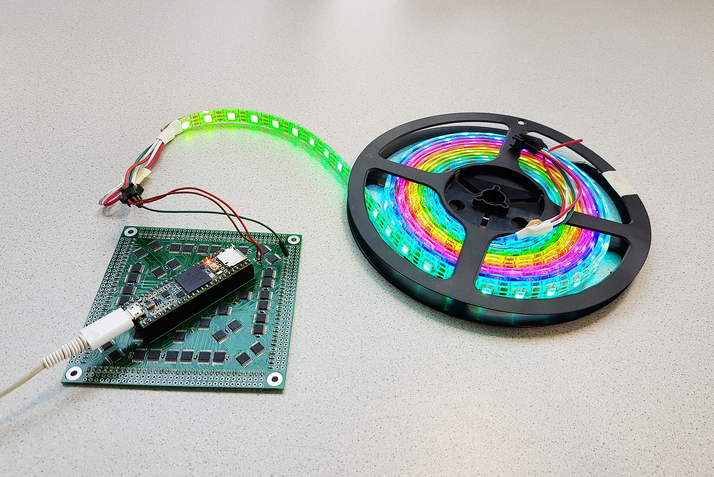
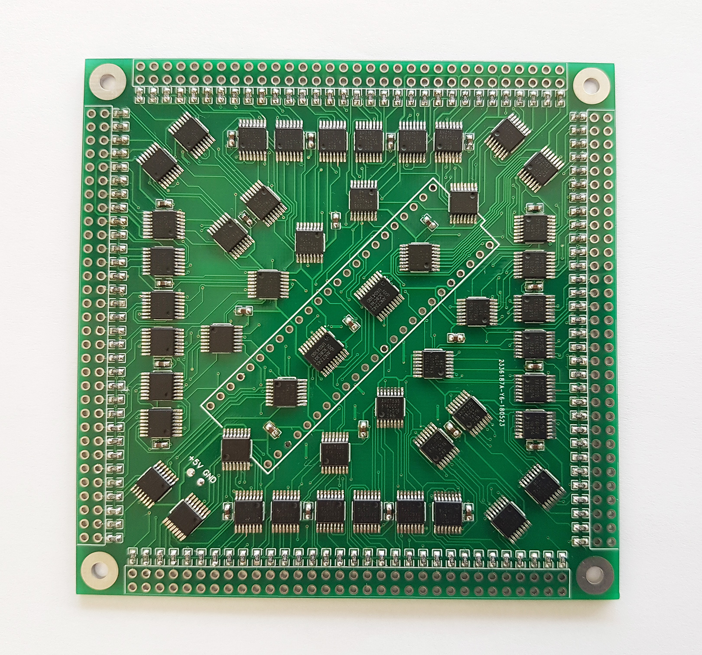

MultiWS2811
==========

Control more WS2811 / WS2812(B) / NeoPixel LEDs at higher refresh speeds.
------

MultiWS2811 is a library that is used with the accompanying adaptor board for the Teensy 3.6 allowing 128 channels of WS2811-based LEDs to be controlled simultaneously.

The library is based on OctoWS2811 and uses DMA and FTM timers to control a series of shift register and multiplexer ICs to construct 128 WS2811 data signals.
This means that like OctoWS2811, there is minimal CPU impact, which allows the CPU to prepare the next frame while the current frame is sent out to the LEDs.

The board uses 16 74AHCT595 shift registers, to which the data from memory is copied in parallel using DMA transfers.
32 74AHC157 multiplexers are used to switch the outputs between the data from the shift registers and an temporally aligned PWM signal to construct the constant high and low parts of the WS2811 protocol.
Also, 2 74AHCT245 buffers are used to buffer the data clock, latch clock and the high low signal for the multiplexers, as I wasn't sure if the outputs on the Teensy are able to drive that many IC's directly (better safe than sorry).
The schematic can be found [here](board/schematic.pdf).

The maximum amount of LEDs is currently limited to around 42240 by the amount of RAM on the Teensy 3.6.
The advantage of having 128 channels as opposed to 8 (max that OctoWS2811 allows), is the ability to achieve higher frame rates when using a lot of LEDs. For example; if you want at least 60 Hz, with 8 channels you're limited to 4416 LEDs, with 128 channels you can push it to the limit of 42240 LEDs and still achieve a frame rate of 100 Hz.

